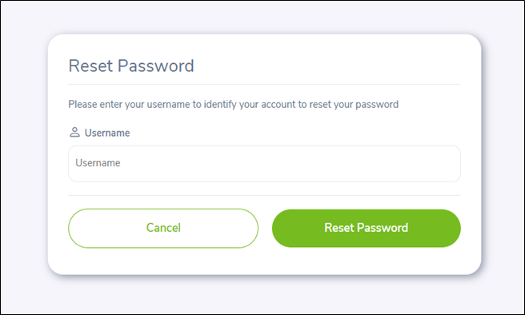
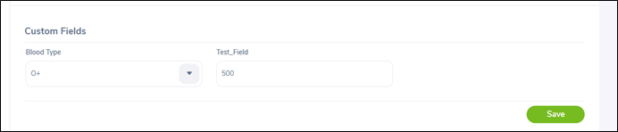

# 
 USER MANUAL - APLIKASI ORANGEHRM 

 Versi: 1.0.0 

 Tanggal Rilis: 16 Juli 2025 

 Penulis: Rohmatul Jannah 

## 📑 Daftar Isi
- 📘 [1. Pendahuluan](#1-pendahuluan)
- 💻 [2. Persyaratan Sistem](#2-persyaratan-sistem)
- 🌐 [3. Akses Aplikasi](#3-akses-aplikasi)
- 🧭 [4. Panduan Penggunaan Modul](#4-panduan-penggunaan-modul)
    - 🔐 [4.1 Login](#41-login)
    - 📊 [4.2 Dashboard](#42-dashboard)
    - 👤 [4.3 My Info - Personal Details](#43-my-info---personal-details)
- ❓ [5. Frequently Asked Questions (FAQ)](#5-frequently-asked-questions-faq)
- ☎️ [6. Kontak Bantuan](#6-kontak-bantuan)
- 📘 [7. Glosarium](#6-glosarium)

## 1. 📘Pendahuluan

**OrangeHRM (Open HR Management)** adalah aplikasi berbasis website yang digunakan oleh divisi Human Resource untuk mengelola sumber daya manusia (SDM) secara terintegrasi. Aplikasi ini menyediakan berbagai fitur seperti manajemen data admin, PIM (Personnel Information Management), leave, time, recruitment, my info, performance, directory, maintenance, claim, buzz. Namun, dalam dokumen ini hanya akan dibahas 3 modul/fitur utama yaitu login, dashboard, my info - personal details. Dokumen ini bertujuan untuk membantu pengguna memahami cara mengakses dan menggunakan ketiga fitur tersebut.

## 2. 💻Persyaratan Sistem

Dalam penggunaan OrangeHRM terdapat persyaratan sistem yang harus dipersiapkan pengguna sebagai berikut:
1.	Web browser seperti Google Chrome, Firefox atau Microsoft Edge
2.	Perangkat berupa PC, laptop atau tablet, mouse
3.	Koneksi internet yang stabil

## 3. 🌐Akses Aplikasi

Dalam mengakses OrangeHRM dilakukan dengan beberapa langkah sebagai berikut:
1.	Buka browser, lalu akses URL https://opensource-demo.orangehrmlive.com/
2.	Masukkan username dan password yang telah diberikan
3.	Terakhir, klik tombol “Login”

## 4. 🧭Panduan Penggunaan Modul

Panduan penggunaan modul/fitur ini digunakan untuk admin dalam mengakses modul/fitur login, dashboard dan my info – personal details. Langkah-langkah penggunaan modul tersebut dijelaskan sebagai berikut:

### 4.1 🔐Login

Aplikasi OrangeHRM terdapat modul/fitur login untuk masuk kedalam sistem atau aplikasi. Untuk login, pengguna dapat mengakses URL aplikasi (https://opensource-demo.orangehrmlive.com/), kemudian mengisi username dan password. Terakhir, klik tombol “Login”. Jika login berhasil akan diarahkan ke halaman dashboard sesuai akun pengguna dan jika login gagal diminta untuk memasukkan data login kembali serta ditampilkan pesan kesalahan berupa “Invalid Credential”. Halaman login dapat dilihat pada Gambar 1 dan ketika gagal login dapat dilihat pada Gambar 2.

    
  Gambar 1. Halaman Login

    
  Gambar 2. Halaman Gagal Login

Pada halaman login terdapat teks “Forgot your password” digunakan untuk melakukan reset password akun pengguna. Pada halaman reset password akun pengguna terdapat field username yang harus diisi dan klik tombol “Reset Password”. Jika pengguna membatalkan proses reset password dapat dilakukan dengan klik tombol “Cancel”. Halaman reset password dapat dilihat pada Gambar 3.

    
  Gambar 3. Halaman Reset Password

### 4.2 📊Dashboard

Aplikasi OrangeHRM terdapat modul/fitur dashboard yang diakses admin dengan melakukan login terlebih dahulu pada halaman login. Dashboard menampilkan widget sebagai ringkasan informasi seputar fitur dari aplikasi berupa grafik. Widget di dashboard terdiri dari Time at Work, My Actions, Quick Lunch, Buzz Latest Posts, Employees on Leave Today, Employee Distribution by Sub Unit dan Employee Distribution by Location. Halaman dashboard dapat dilihat pada Gambar 4 hingga Gambar 6.

    
  Gambar 4. Halaman Dashboard

    
  Gambar 5. Halaman Dashboard – Employees on Leave Today dan Distribution by Sub Unit

    
  Gambar 6. Halaman Dashboard – Employee Distribution by Location

Widget di dashboard memiliki kegunaan masing-masing yang dijelaskan sebagai berikut:
1)	Time at Work merupakan widget untuk menampilkan jam kerja karyawan.
2)	My Actions merupakan widget sebagai daftar tugas yang perlu pengguna lakukan.
3)	Quick Lunch merupakan widget untuk mengakses pintasan ke halaman yang sering digunakan seperti assign leave, leave list, timesheets, apply leave, my leave dan my timesheet. 
4)	Buzz Latest Posts merupakan widget untuk menampilkan postingan terbaru di fitur Buzz dari seluruh pengguna.
5)	Employees on Leave Today merupakan widget untuk menampilkan daftar karyawan yang sedang cuti di hari tersebut.
6)	Employee Distribution by Sub Unit merupakan widget untuk menampilkan distribusi jumlah karyawan berdasarkan unit kerja atau divisi.
7)	Employee Distribution by Location merupakan widget untuk menampilkan jumlah karyawan berdasarkan lokasi kerja.

### 4.3 👤My Info - Personal Details

Modul My Info - Personal Details merupakan modul yang digunakan untuk menampilkan detail dari pengguna yang sedang login serta dapat melakukan perubahan data. Dalam mengakses personal details dilakukan dengan mengklik menu My Info. Pada halaman my info menampilkan informasi detail pengguna yang sedang login. Informasi dalam personal details terdapat 3 bagian yaitu personal details, custom fields dan attachments.
Pada bagian personal details terdapat field yang berisi informasi pengguna terdiri dari Employee Full Name, Employee Id, Other Id, Driver's License Number, License Expiry Date, Nationality, Marital Status, Date of Birth dan Gender, Setiap field dalam personal details dapat diubah sesuai dengan yang diinginkan pengguna dengan menuliskan perubahan pada field tersebut dan mengklik tombol “Save” untuk menyimpan perubahan datanya. Halaman personal details dapat dilihat pada Gambar 7.

   
  Gambar 7. Halaman Personal Details

Pada bagian custom fields terdapat blood type digunakan untuk mencatat golongan darah karyawan/pengguna yang bertujuan untuk keperluan darurat medis. Pengguna dapat mengubah nilai dalam field blood type dan test_field sesuai yang diinginkan, kemudian klik tombol “Save” untuk menyimpan perubahan datanya. Halaman personal details bagian custom fields dapat dilihat pada Gambar 8.

   
  Gambar 8. Halaman Personal Details – Custom Field 

Pada bagian attachments digunakan untuk mengunggah dan mneyimpan dokumen atau file penting yang terkait karyawan. Dalam attachments dapat melakukan add, edit, delete dan download dokumen. Halaman personal details bagian attachments dapat dilihat pada Gambar 9.

   
  Gambar 9. Halaman Personal Details – Attachments 

Pada bagian attachment terdapat tombol add untuk menambahkan data dokumen dengan cara memilih file dan menuliskan komentar dokumen. Dokumen/file yang diunggah memiliki ketentuan ukuran maksimal 1 Mbs. Selanjutnya, klik tombol “Save” untuk menambahkan data attachment. Halaman add attachment dapat dilihat pada Gambar 10.

   
  Gambar 10. Halaman Attachments – Add Attachment

Pada bagian attachment terdapat tombol edit untuk mengubah data dokumen dengan cara memilih salah satu data dan klik tombol edit. Pada halaman edit attachment terdapat field current file, replace with dan comment. Pada field replace with memiliki ketentuan file maksimal 1 Mbs. Selanjutnya, klik tombol “Save” untuk mengubah data attachment. Halaman edit attachment dapat dilihat pada Gambar 11.

   
  Gambar 11. Halaman Attachments – Edit Attachment 

Pada bagian attachment terdapat tombol delete untuk menghapus data dokumen dengan cara memilih salah satu data dan klik tombol delete. Kemudian, sistem menampilkan pop-up konfirmasi hapus data. Jika pengguna ingin menghapus data, maka klik tombol “Yes, Delete” dan jika ingin membatalkan dilakukan dengan klik tombol “No, Cancel”. Halaman delete attachment dapat dilihat pada Gambar 12.

   
  Gambar 12. Halaman Attachments – Delete Attachment 

## 5. ❓Frequently Asked Questions (FAQ)

Q: Saya mengalami lupa *password*. Apa yang harus saya lakukan?
A: Klik *“Forgot your password”* di halaman login dan ikuti perintah untuk *reset password*.

Q: Mengapa tidak bisa menyimpan data di *personal details*?
A: Pastikan semua *field* terisi dan koneksi internet stabil.

## 6. ☎️Kontak Bantuan
Jika Anda mengalami kendala saat menggunakan aplikasi, silahkan hubungi administrator sistem atau tim IT Internal.

## 7.📘 Glosarium
| Istilah                            | Definisi                                                                                                         |
|------------------------------------|------------------------------------------------------------------------------------------------------------------|
| **Admin**                          | Pengguna dengan hak akses penuh untuk mengelola dan memodifikasi data di aplikasi OrangeHRM.                    |
| **Attachment**                     | Lampiran berupa file atau dokumen yang diunggah pada sistem, biasanya terkait dengan data karyawan.             |
| **Buzz**                           | Fitur di OrangeHRM yang berfungsi sebagai media sosial internal perusahaan untuk membagikan kabar atau update.  |
| **Dashboard**                      | Halaman utama setelah login yang berisi ringkasan informasi dan berbagai widget.                                |
| **Field**                          | Kolom atau bagian dalam formulir yang berisi data atau informasi, seperti nama, tanggal lahir, dll.            |
| **Login**                          | Proses masuk ke sistem menggunakan username dan password.                                                       |
| **My Info**                        | Modul yang menampilkan dan memungkinkan pengguna untuk mengubah data pribadi mereka.                            |
| **Personal Details**               | Informasi pribadi pengguna seperti nama lengkap, tanggal lahir, jenis kelamin, dan status pernikahan.          |
| **PIM (Personnel Information Management)** | Modul dalam OrangeHRM untuk mengelola data karyawan secara menyeluruh.                                 |
| **Reset Password**                 | Proses untuk mengganti kata sandi yang terlupa atau ingin diperbarui.                                           |
| **Sub Unit**                       | Unit atau divisi kerja yang berada di bawah struktur organisasi perusahaan.                                     |
| **Widget**                         | Komponen interaktif pada dashboard yang menampilkan informasi secara ringkas dan visual, seperti grafik.        |
